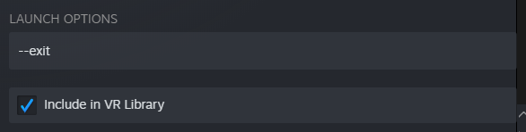

# SteamVRHelper

 

_A small tool to enhance performance in SteamVR_


## Download Instructions

1. Download SteamVRHelper from the [releases tab](https://github.com/luximus-hunter/SteamVRHelper/releases/latest).
2. Extract the `.zip` and put the folder somewhere safe. Placing it at `c:\Users\username\SteamVRHelper` is recommended.
3. Run the program once and close it again. There should be two folders in the `SteamVRHelper` folder:
    - `BackupFiles`
    - `TemplateFiles`
4. Download [OculusKiller](https://github.com/ItsKaitlyn03/OculusKiller/releases/latest) and place it in the `TemplateFiles` folder.
5. Download [OpenVR_SFR](https://github.com/fholger/openvr_fsr/releases/latest). Extract the `.zip` and move the following two files to the `TemplateFiles` folder:
    - `openvr_api.dll`
    - `openvr_mod.cfg`
6. Done!

## VR Service


**⚠️ Only for those that use Oculus ⚠️**

When you connect your Oculus headset through linkcable, it will open the Oculus Dash before you can enter SteamVR. This option lets you choose if you want to use SteamVR or the Oculus Dash when you connect to through linkcable.

_When you click `Exit VR` within the SteamVR menu, SteamVR will open again. Read [exiting](#exiting) to fix this._

## Exiting


Clicking this button will close SteamVR.

---

**⚠️ Only for those that use Oculus ⚠️**

To make it easier to exit SteamVR, you can add `SteamVRHelper.exe` as a non-Steam game to your library. Go to its `Properties` in the right-click menu and enter the following at the Launch Options:



When you click SteamVRHelper in the SteamVR library, it will close SteamVR and the Oculus client, bringing you to your Oculus Home.

You can also add a custom artwork to `SteamVRHelper` so it looks nicer in the SteamVR library. You can make your own or download mine:


## Upscaling


Enabling this will use AMD FSR or NVidea NIS to render your games at a lower resolution and scale them up to original resolution.

The `Render Scale` is what percentage of the original resolution to render at.

```
Default: 0.77
```

The `Sharpness` is how much you want to sharpen the upscaled image, since it can lack detail in some cases

```
Default: 0.9
```

Clicking `Apply` will apply the changes to all the games displayed in the list on the right.

**⚠️ You cant select specific games, _yet_ ⚠️**

_If a game doesn't work with upscaling, Disable upscaling before you start that game._